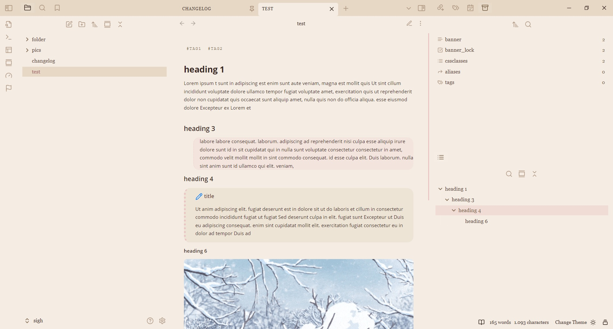

### note: This theme will be updated and merged with Cocoa into a single theme with light/dark mode sometime in the near future.

# parfait

### delicious theme 2 (light)

Formatting: like in my aged whisky theme, the editor content is aligned left in reading mode.

This theme does not use a fixed font other than in tabs and tags.

Update: The readable line length now uses a less aggressive method and will no longer override snippets that change the width, such as wide view.

Screenshot:

